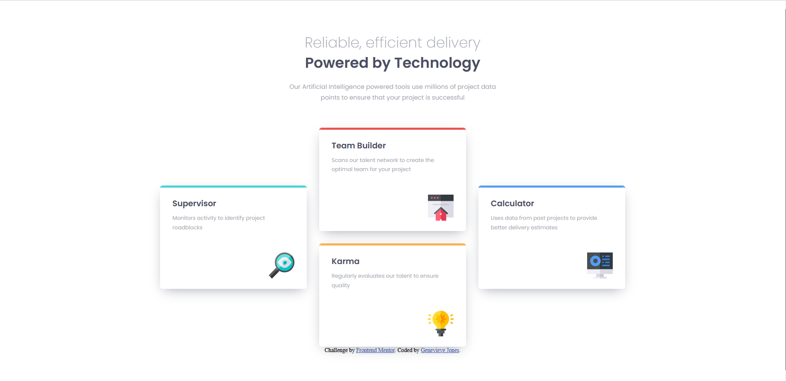

# Frontend Mentor - Four card feature section solution

This is a solution to the [Four card feature section challenge on Frontend Mentor](https://www.frontendmentor.io/challenges/four-card-feature-section-weK1eFYK). Frontend Mentor challenges help you improve your coding skills by building realistic projects. 

## Table of contents

- [Overview](#overview)
  - [The challenge](#the-challenge)
  - [Screenshot](#screenshot)
- [My process](#my-process)
  - [Built with](#built-with)
  - [What I learned](#what-i-learned)
  - [Continued development](#continued-development)
  - [Useful resources](#useful-resources)
- [Author](#author)
- [Acknowledgments](#acknowledgments)

## Overview
This is my first real frontend project. The flexbox version was made by going through [Kevin Powell's tutorial](https://www.youtube.com/watch?v=JFbxl_VmIx0&t=2184s), pausing at each section and doing it myself, before refining it following his advice. The grid version was made mostly on my own, with occasional references to my flexbox code and consulting MDN and Stack Overflow when I got stuck. I think I did pretty well on everything but the shadow color and the h1 font-size in mobile view.

### The challenge

Users should be able to:

- View the optimal layout for the site depending on their device's screen size

### Screenshot

Flexbox Version:

Grid Version:

## My process

### Built with

- Semantic HTML5 markup
- CSS custom properties
- Flexbox
- CSS Grid
- Desktop-first workflow
- Mobile-first workflow

### What I learned

I learned how to create a website off of a design without measurements and, through that, how to match my development's sizing to a design's. I also learned how to create grids from adjacent flexboxes. I also learned about the differences between and when to use margins or padding.

### Continued development

I want to continue focusing on and learning about mobile-first design and the many ways a design can be developed into an actual website, so that I can expand my toolbox of methods.

## Author

- Github - [Genevieve Jones](https://github.com/Jeanneveev)
- Frontend Mentor - [@yourusername](https://www.frontendmentor.io/profile/Jeanneveev)

## Acknowledgments
I wish to give thanks again to Kevin Powell for his video which guided me and many others through this project. Also to the Frontend Mentor Discord and MDN docs for giving further help on specific questions.